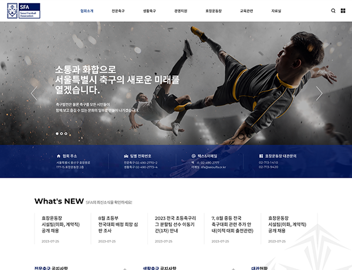

# ⚽ 기장군민축구단 (Gijang United FC)

<a href="https://seoldi.github.io/gijangunited/demo.html" target="_blank">👉 데모 보기 (16 pages)</a> &nbsp;|&nbsp;
<a href="https://www.gijangunited.com/" target="_blank">🌐 실운영 사이트</a>

---

## 📸 Screenshots

---

부산기장군민축구단 공식 홈페이지 GnuBoard5 커스텀 테마입니다.  
메인 슬라이더부터 경기 결과·순위표·선수단·갤러리까지, 축구단 운영에 필요한 전 기능을 커스텀 스킨으로 구현했습니다.

### 주요 기능

**사이트 구성**
- 메인 슬라이더 (DB 연동, JS 텍스트 오버레이 애니메이션)
- 구단 소개 — 단장 인사 · 엠블럼 · 마스코트 · 조직도
- 선수단 프로필 (커스텀 board 스킨 — 번호·포지션·이미지)
- 경기 결과 (날짜·장소·홈/어웨이 스코어 구조화 출력)
- 팀 순위표 (득실·승패 통계 포함)
- 갤러리 · 영상 게시판
- 파트너/스폰서 관리 (순서 변경 가능)
- 오시는 길 (카카오맵 연동)
- 완전 반응형 (PC · 모바일)

**커스텀 스킨**
- `skin/board/` — game · ranking · player · partners · gallery · gallery_move · movie
- `skin/latest/` — game · game_prev · game_next · ranking · partners

### 스택
- GnuBoard5 (PHP) — 커스텀 테마 전체 제작
- HTML5 / CSS3 / JavaScript (jQuery)
- 폰트: Independence Hall (헤더 강조)
- 아이콘: Flaticon UIcons

### 담당 업무
UI/UX 디자인 및 프론트엔드 퍼블리싱 전담 (1인).  
기획·디자인·GnuBoard 테마 커스터마이징·커스텀 스킨 제작·모바일 대응까지 전 과정 단독 진행.

---

An official website theme for **Gijang United FC** (부산기장군민축구단), built as a full custom GnuBoard5 template.  
Covers the complete club website — from main visual slider to match results, team rankings, player profiles, and media gallery.

### Features

**Site Sections**
- Main visual slider with DB-driven content and JS text animation
- Club intro — President's message · Emblem · Mascot · Organization chart
- Player profiles (custom board skin — number, position, player photo)
- Match results (structured home/away score display with date & venue)
- League standings (win/draw/loss, goals scored/conceded)
- Photo gallery · Video board
- Partners & sponsors management (drag-to-reorder)
- Location page (Kakao Maps)
- Fully responsive (PC + Mobile)

**Custom Skins**
- `skin/board/` — game · ranking · player · partners · gallery · gallery_move · movie
- `skin/latest/` — game · game_prev · game_next · ranking · partners

### Stack
- GnuBoard5 (PHP) — full custom theme
- HTML5 / CSS3 / JavaScript (jQuery)
- Fonts: Independence Hall (headline accent)
- Icons: Flaticon UIcons

### Role
Sole designer and front-end developer.  
Handled the full process independently — UX planning, visual design, GnuBoard theme customization, custom skin development, and mobile optimization.
